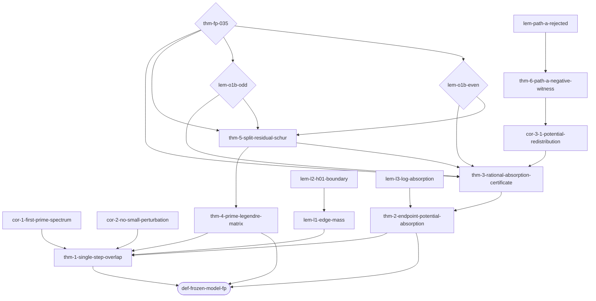

# proofctl Integration Guide

This project uses [proofctl](https://github.com/telleroutlook/proofctl) (≥ v0.2.8)
as the proof orchestration layer. This document describes every proofctl command
used in this project, what each does, and what is intentionally NOT used.

## Setup (once per machine)

```bash
# 1. Build proofctl from source
cd ~/github/proofctl && go build ./cmd/proofctl ./cmd/proofverify

# 2. Copy env template and fill in PROOFCTL_ROOT
cp .proofctl/env.json.example .proofctl/env.json
# Edit .proofctl/env.json: set PROOFCTL_ROOT to your proofctl checkout path

# 3. Generate a signing key (required for independent-review attestations)
proofctl key generate --name fp035-reviewer --out .proofctl/keys/
# .proofctl/keys/fp035-reviewer.priv is gitignored; .pub is committed

# 4. Install pre-commit hook (rejects unsigned attestations)
proofctl git-hook install

# 5. Capture environment lock
proofctl env snapshot --out environment.lock

# 6. Verify environment
proofctl doctor
```

## Daily workflow

### Check proof graph status

```bash
proofctl status               # all claims with OPEN/ACCEPTED/BLOCKED
proofctl status --verbose     # + toolchain versions for accepted claims
proofctl status --watch       # live poll every 2s during active work
```

### Understand dependencies

```bash
proofctl graph                              # text list of claims + deps
proofctl graph --mermaid                    # Mermaid flowchart (paste into docs)
proofctl graph --dot | dot -Tsvg > dag.svg  # Graphviz SVG
proofctl frontier thm-fp-035               # what directly blocks the main theorem
proofctl impact thm-3-rational-absorption-certificate  # what depends on Thm 3
proofctl explain lem-o1b-even              # why is this claim OPEN?
```

### Run checkers

```bash
# Check a specific claim (uses already-imported CAS evidence)
export BRIDGE_CHECKER="python3 checker/first_prime/check_first_prime_certificate.py"
proofctl check @thm-3-rational-absorption-certificate

# Check all claims at once (pytest-style summary)
proofctl check --all

# Dry-run replay (validate CAS + generator syntax without executing)
proofctl replay --claim lem-o1b-even --dry-run \
  --evidence <digest> --generator "python3 src/assemble/assemble.py {cert}"
```

### Import evidence to CAS

```bash
# Import a single certificate file
proofctl cas import certs/cert-even-20260901.json

# Bulk import all certs
proofctl cas import-dir certs/ --pattern "*.json"

# List CAS contents
proofctl cas list

# Remove unreferenced blobs after cert regeneration
proofctl cas gc --dry-run   # preview
proofctl cas gc --yes       # execute
```

### Write attestations

```bash
# Manual independent-review attestation (requires signing key)
proofctl attest \
  --claim thm-1-single-step-overlap \
  --assurance independent-review \
  --outcome accepted \
  --metadata reviewer=<your-orcid-or-name> \
  --key .proofctl/keys/fp035-reviewer.priv

# Diff between current and previous attestation
proofctl attest diff thm-1-single-step-overlap
```

### Release gate

```bash
# Always use --dry-run first
proofctl release --dry-run

# Shadow mode evaluation (O1-B + O2 not yet closed)
# proofctl release --shadow   ← not needed; shadow_mode=true in config is documentation
# just use --dry-run until both sectors certified
```

### Snapshots (track progress over time)

```bash
proofctl snapshot --output-dir .proofctl/snapshots/

# Compare two snapshots
proofctl snapshot --diff \
  .proofctl/snapshots/2026-08-05.snapshot.json \
  .proofctl/snapshots/2026-09-01.snapshot.json
```

### Environment management

```bash
proofctl env show                          # show BRIDGE_CHECKER, PROOFCTL_ADAPTERS
proofctl env verify --lock environment.lock  # confirm env matches lock
proofctl env snapshot --out environment.lock --force  # update lock after dep changes
```

### Checker pinning (run after any checker script change)

```bash
proofctl pin checker \
  --cmd "python3 checker/first_prime/check_first_prime_certificate.py" \
  --lock environment.lock \
  --schema schemas/certificate-first-prime-v1.schema.json

proofctl pin checker \
  --cmd "python3 checker/archimedean/check_archimedean.py" \
  --lock environment.lock \
  --schema schemas/certificate-archimedean-v1.schema.json
```

### Bundle (only after both sectors certified)

```bash
proofctl bundle create --output .proofctl/bundle/
proofctl bundle verify .proofctl/bundle/
proofverify bundle.verify .proofctl/bundle/
```

### Cache management

```bash
proofctl cache show-key lem-o1b-even    # explain cache key composition
proofctl cache invalidate lem-o1b-even  # force re-check after checker change
proofctl cache invalidate --all         # reset all after major refactor
```

---

## What is NOT used (and why)

| Command | Reason not used |
|---|---|
| `proofctl compile --adapter weil` | Weil adapter generates D1–D18 shadow attestations for weil-lower-bound; fp035 has a different claim structure |
| `proofctl compile --adapter qmd` | No QMD source documents in this project |
| `proofctl export --format lean` | E3 (Lean 4 formalisation) is a future goal; will be used when Lean proofs are written |
| `proofctl mutate` | Project has its own schema mutation tests in `tests/mutation/`; platform-level mutations cover different attack vectors |
| `proofctl domains list` | fp035 is not yet in proofctl's KnownDomains registry (pending proofctl update) |
| `proofctl init --domain fp035` | Same reason; will work after fp035 is registered |
| `proofctl release` (non-dry-run) | O1-B and O2 not closed; shadow_mode=true; only `--dry-run` is safe |

---

## Required proofctl changes (pending in proofctl repo)

See PLAN.md §seven for the full list. The four blocking issues:

1. **Tag v0.2.9** — this project declares `proofctl_min_version: "0.2.8"` now (was 0.2.9); no action needed until next proofctl release
2. **`bridge.py` metadata keys** — needs `window_verified`, `archimedean_obligation`, `pivot_count` extraction
3. **`--adapter contract-dir`** — compile ContractV2 directory directly to graph.json
4. **Register `fp035` domain** — enable `proofctl init --domain fp035`

---

## Claim graph (proofctl graph --mermaid output)



Nodes with `{}` are conjectures (open). All other nodes are closed theorems/lemmas.
